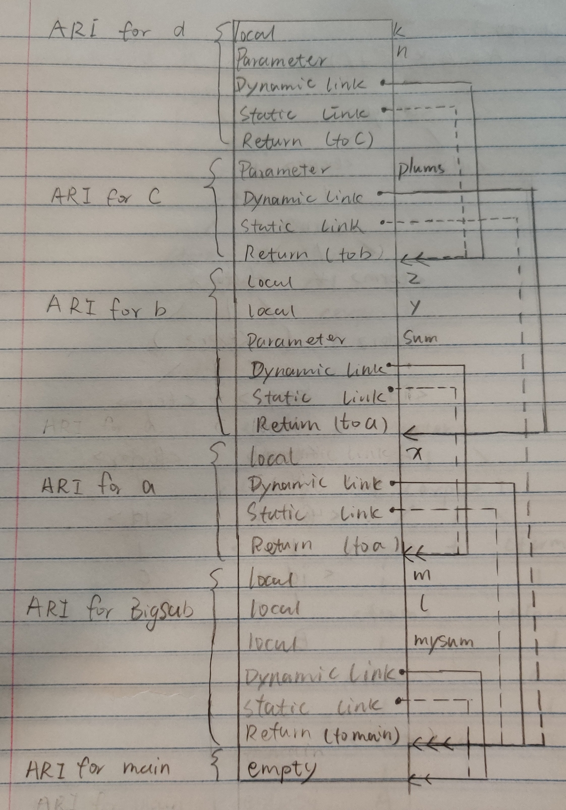
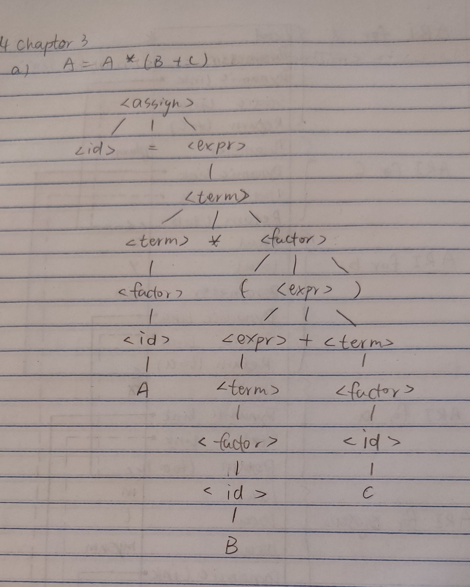
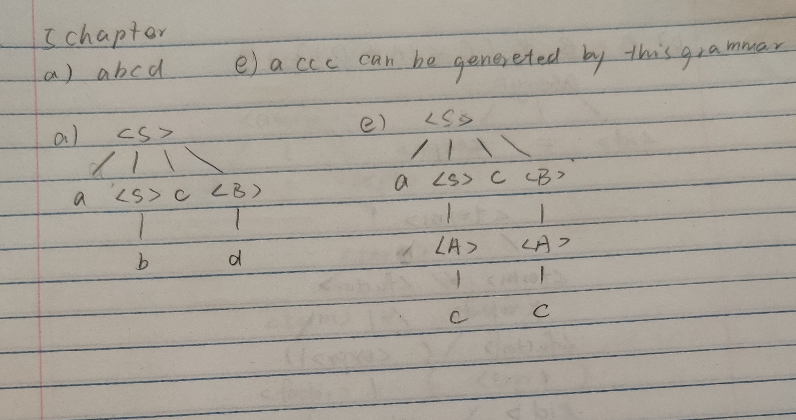

Bohan Feng Homework06
---
#### 1
*python*
```
def adder(*argv):
	sum = 0
	for value in argv:
		sum += value
	return sum

print("Sum 1 is", adder(1,2,3,4,5,6))
print("Sum 2 is", adder(1,5))
print("Sum 3 is", adder())
```
*Java*
```
public class hw6 {

	public static int adder(int ...args)
	{
		int sum = 0;
		
		for (int i : args){
			sum += i;
		}
		
		return sum;
	}
	public static void main(String [] args)
	{
		System.out.println("Sum 1 is " + adder(1,2,3,4,5,6));		
		System.out.println("Sum 2 is " + adder(1,5));		
		System.out.println("Sum 3 is " + adder());
	}
}
```

*C#*

```
using System;

namespace hw6 {
	class hw6 {
		public static int Adder(params int[] args)
		{
			int sum = 0;
			
			for (int i = 0; i < args.Length; i++){
				sum += args[i];
			}
			
			return sum;
		}
		
		public static int Main(String [] args)
		{
			Console.WriteLine("Sum 1 is {0}", Adder(1,2,3,4,5,6));
			Console.WriteLine("Sum 2 is {0}", Adder(1,5));
			Console.WriteLine("Sum 3 is {0}", Adder());
			
			return 0;
		}
	}
}
```
#### 2


#### 3
##### a)
```
<case statement> ::= case <expression> of <case list element> end
::= <simple expression> of <case list element> end
::= case <term> of <case list element> end
::= case <factor> of <case list element> end
::= case <unsigned contant> of <case list element> end
::= case <unsigned number> of <case list element> end
::= case <unsigned integer> of <case list element> end
::= case <digit> of <case list element> end
::= case <digit> of <empty> end
```
##### b)
```
<program> ::= program <identifier>; <block>
::= program <letter>; <block>
::= program <letter>; <label declaration part> <contant definition part> <type definition part> <variable declaration part>
::= program <letter>; <empty> <contant definition part> <type definition part> <variable declaration part>
::= program <letter>; <empty> <empty> <type definition part> <variable declaration part>
::= program <letter>; <empty> <empty> <empty> <variable declaration part>
::= program <letter>; <empty> <empty> <empty> <empty>
```

#### 4
##### a)

##### b)


#### 5


