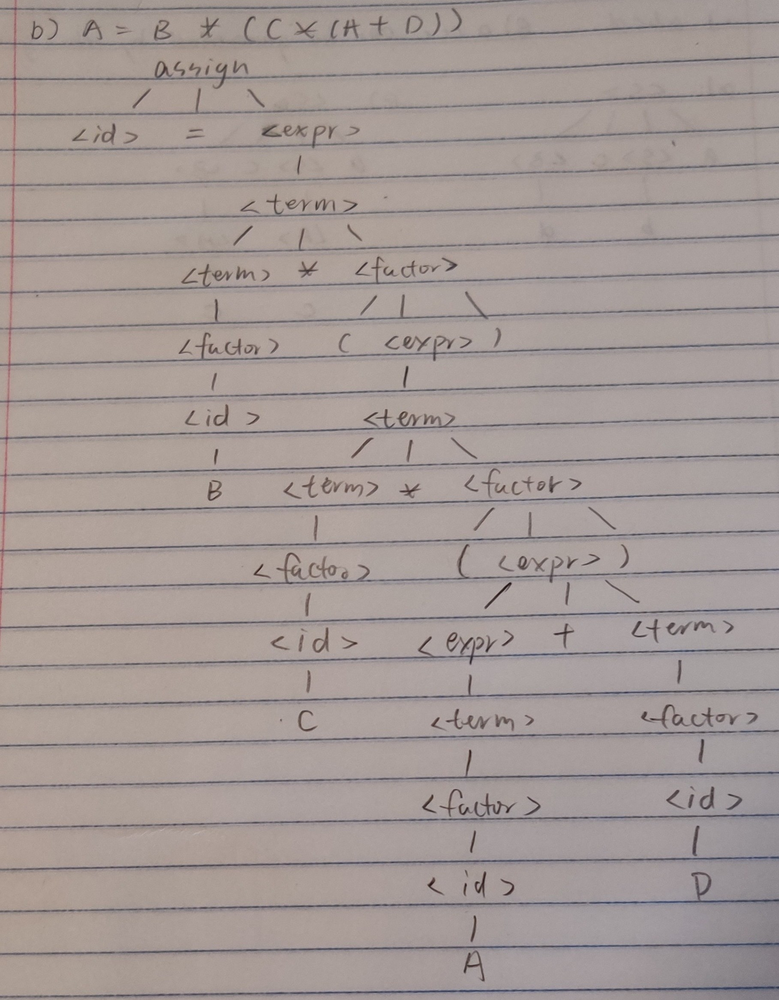

#### 2


#### 3
##### a)
```
<case statement> ::= case <expression> of <case list element> end
::= <simple expression> of <case list element> end
::= case <term> of <case list element> end
::= case <factor> of <case list element> end
::= case <unsigned contant> of <case list element> end
::= case <unsigned number> of <case list element> end
::= case <unsigned integer> of <case list element> end
::= case <digit> of <case list element> end
::= case <digit> of <empty> end
```
##### b)
```
<program> ::= program <identifier>; <block>
::= program <letter>; <block>
::= program <letter>; <label declaration part> <contant definition part> <type definition part> <variable declaration part>
::= program <letter>; <empty> <contant definition part> <type definition part> <variable declaration part>
::= program <letter>; <empty> <empty> <type definition part> <variable declaration part>
::= program <letter>; <empty> <empty> <empty> <variable declaration part>
::= program <letter>; <empty> <empty> <empty> <empty>

```
#### 4



